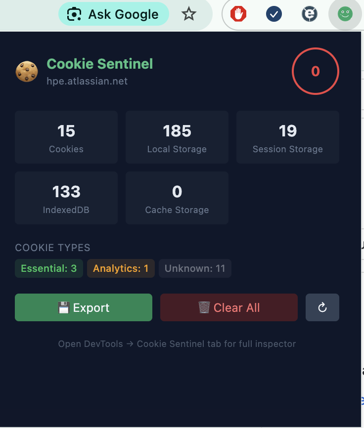
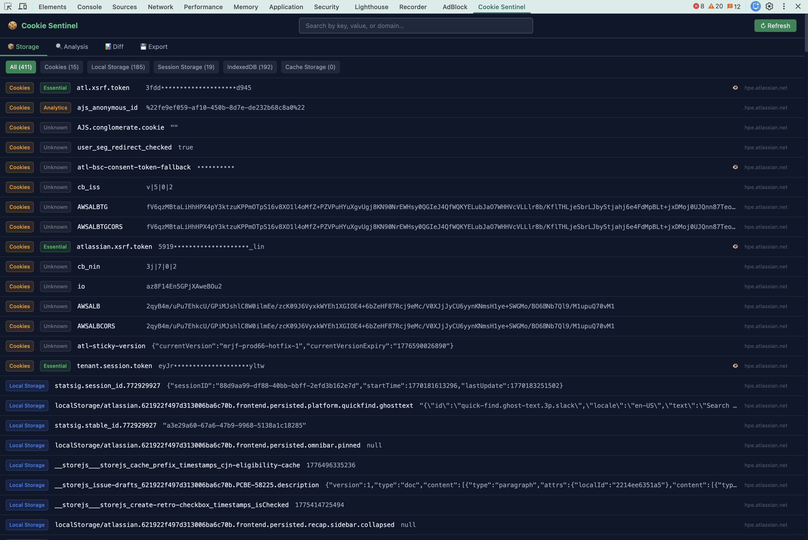

<p align="center">
  
</p>

<h1 align="center">🍪 Cookie Sentinel</h1>

<p align="center">
  <strong>See everything your browser stores. Search, edit, analyze, export.</strong><br/>
  Unified cookie &amp; storage inspector with privacy scoring.
</p>

<p align="center">
  <a href="https://github.com/bhayanak/cookie-monster/actions/workflows/ci.yml">
    
  </a>
  <a href="https://codecov.io/gh/bhayanak/cookie-monster">
    
  </a>
  
  
  
  = 18" />
  
  
</p>

---

## Features

| Feature | Description |
|---------|-------------|
| **Unified View** | Cookies, localStorage, sessionStorage, IndexedDB, and Cache Storage — all in one panel |
| **Search & Filter** | Search across ALL storage types by key, value, or domain |
| **CRUD Operations** | Create, read, update, delete any storage entry |
| **Cookie Classification** | Auto-classify cookies as Essential / Functional / Analytics / Tracking |
| **Privacy Score** | Per-site privacy score (0–100) based on cookie/tracker analysis |
| **Snapshot Diff** | Take snapshots before & after actions, see exactly what changed |
| **Export / Import** | Export all storage as JSON for debugging or sharing |
| **Quick Popup** | Glanceable summary with one-click export and clear-all |
| **DevTools Panel** | Full-featured inspector integrated into Chrome/Firefox DevTools |

## Screens
<p align="center">
  
</p>
<p align="center">
  
</p>


## Install

### From Source (Development)

```bash
# Clone
git clone https://github.com/user/cookie-monster.git
cd cookie-monster

# Install dependencies
pnpm install

# Development build with hot reload
pnpm dev
```

Then load in Chrome:
1. Navigate to `chrome://extensions`
2. Enable **Developer mode**
3. Click **Load unpacked**
4. Select the `dist/` folder

### From Store

- **Chrome Web Store**: _Coming soon_
- **Firefox Add-ons**: _Coming soon_
Note: Use github release for installing extensions/addons for now.

## Comparison

| Feature | Cookie Sentinel | EditThisCookie | DevTools Built-in |
|---------|:-:|:-:|:-:|
| Manifest V3 | ✅ | ❌ (MV2) | N/A |
| Unified storage view | ✅ | ❌ | ❌ (separate tabs) |
| Cookie classification | ✅ | ❌ | ❌ |
| Privacy score | ✅ | ❌ | ❌ |
| Snapshot diff | ✅ | ❌ | ❌ |
| IndexedDB browser | ✅ | ❌ | ✅ |
| Cache Storage browser | ✅ | ❌ | ✅ |
| Export/Import | ✅ | ✅ | ❌ |
| Search all types | ✅ | ❌ | Partial |
| Sensitive value masking | ✅ | ❌ | ❌ |
| Open source | ✅ | ✅ | N/A |

## Usage

### DevTools Panel

1. Open DevTools (`F12` or `Cmd+Opt+I`)
2. Navigate to the **Cookie Sentinel** tab
3. Browse all storage entries in the unified view
4. Use the search bar to filter by key, value, or domain
5. Click any entry to see full details (value, metadata, classification)

### Popup

Click the extension icon in the toolbar for a quick summary:
- Privacy score at a glance
- Storage counts per type
- One-click export and clear-all

### Privacy Score

Cookie Sentinel rates each site from 0 to 100:

| Score | Rating | Meaning |
|-------|--------|---------|
| 80–100 | 🟢 Excellent | Minimal tracking, mostly essential cookies |
| 60–79 | 🟡 Good | Some analytics, limited tracking |
| 40–59 | 🟠 Fair | Multiple trackers or third-party cookies |
| 0–39 | 🔴 Poor | Heavy tracking, many third-party cookies |

Classification uses a bundled rules database — **no external requests** are made.

## Development
### Prerequisites

- Node.js >= 18
- pnpm >= 9

## Security

- Sensitive cookie values (session, token, auth, CSRF) are **masked by default**
- HttpOnly cookies read via `chrome.cookies` API, never via injected scripts
- All values rendered as `textContent` to prevent XSS
- Export warns about potentially sensitive data
- Classification database is bundled — **zero external network requests**
- Extension collects **no telemetry or analytics** whatsoever

## Contributing

See [CONTRIBUTING.md](docs/CONTRIBUTING.md) for guidelines.

## License

[MIT](LICENSE) — Use it, fork it, ship it.
